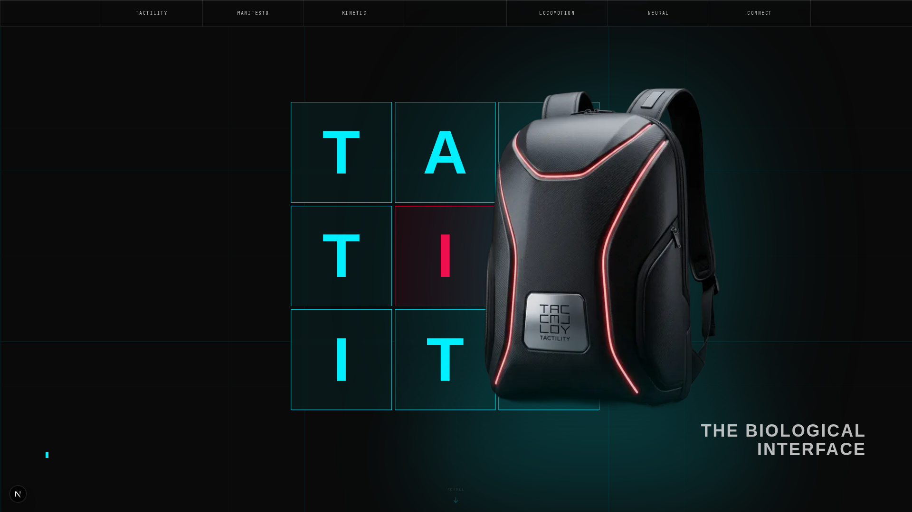

# TACTILITY — The Biological Interface

A cinematic scrollytelling website for a cybernetic product ecosystem. Built with Next.js 16, GSAP, and Lenis.



## Overview

TACTILITY is a premium brand experience website that showcases a fictional cybernetic product ecosystem. The site features:

- **Cinematic Scrollytelling** — Narrative-driven scroll experience with three-act structure
- **Product-Specific Animations** — Each product section has unique reveal animations (slide, rise, scale)
- **Parallax Depth** — Multi-plane visual depth with scroll-linked parallax
- **Emotional Arc** — Curated emotional journey from curiosity to climax to resolution

## Sections

| Section | Purpose | Animation Style |
|---------|---------|-----------------|
| Hero | Hook with 3x3 grid + terminal typing | Entrance + float |
| Manifesto | Brand philosophy statements | Staggered text reveal, climax pulse |
| Breath | Visual rest before products | Fade-in |
| FullBleed | Transition with marquee | Scroll-driven color overlay |
| BentoGrid | Product ecosystem overview | Clip-path reveal, hover lift |
| Kinetic | Bag product line | Slide from right |
| Locomotion | Footwear product line | Rise from bottom |
| Neural | Peripheral accessories | Scale from center |
| Climax | Emotional peak moment | Grid activation, dolly-in |
| Carousel | Product line showcase | Horizontal scroll |
| CTA | Email subscription | Terminal-style interaction |

## Tech Stack

- **Framework:** Next.js 16 (App Router, Turbopack)
- **Animation:** GSAP 3 + ScrollTrigger
- **Smooth Scroll:** Lenis
- **Styling:** Tailwind CSS 4
- **Analytics:** Vercel Analytics
- **Language:** TypeScript

## Getting Started

```bash
# Install dependencies
pnpm install

# Run development server
pnpm dev

# Build for production
pnpm build

# Start production server
pnpm start
```

Open [http://localhost:3000](http://localhost:3000) to view the site.

## Project Structure

```
src/
├── app/
│   ├── api/subscribe/    # Email subscription endpoint
│   ├── globals.css       # Design tokens + animations
│   ├── layout.tsx        # Root layout with analytics
│   └── page.tsx          # Main page composition
├── components/
│   ├── HeroSection.tsx
│   ├── ManifestoSection.tsx
│   ├── BreathSection.tsx
│   ├── FullBleedSection.tsx
│   ├── BentoGridSection.tsx
│   ├── KineticSection.tsx
│   ├── LocomotionSection.tsx
│   ├── NeuralSection.tsx
│   ├── ClimaxSection.tsx
│   ├── HorizontalCarousel.tsx
│   ├── CtaSection.tsx
│   ├── Navigation.tsx
│   └── SmoothScroll.tsx
└── public/images/webp/   # Product imagery
```

## Design Decisions

### Scrub Values (Pacing)
- Quick reveals: `scrub: 0.8`
- Moderate animations: `scrub: 1.2-1.5`
- Emotional moments: `scrub: 2-4`

### Product Animations
- **Kinetic (Bags):** Slide from right — bags are carried
- **Locomotion (Footwear):** Rise from bottom — footwear steps up
- **Neural (Accessories):** Scale from center — rings and peripherals expand

### Color Palette
- **Cyan (#00F0FF):** Primary accent, technology, interface
- **Crimson (#FF0044):** Secondary accent, emotion, evolution
- **Amber (#FFB000):** Tertiary accent, energy, data

## Deployment

Deploy to Vercel:

```bash
# Via CLI
vercel --prod

# Or import from GitHub at vercel.com/new
```

## Performance

- Mobile-optimized animations (skipped on <768px)
- Respects `prefers-reduced-motion`
- Lazy loading for below-fold images
- `will-change` hints for animated elements

## License

MIT

---

Built by [Dream Pixels Forge](https://github.com/Dream-Pixels-Forge)
